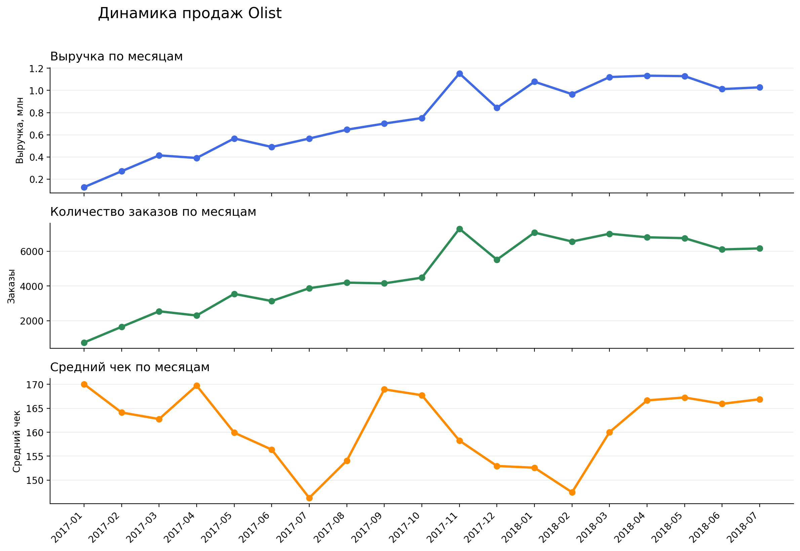
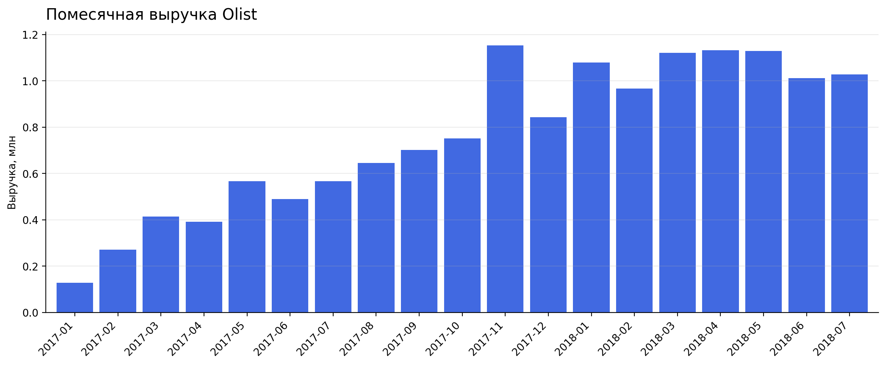
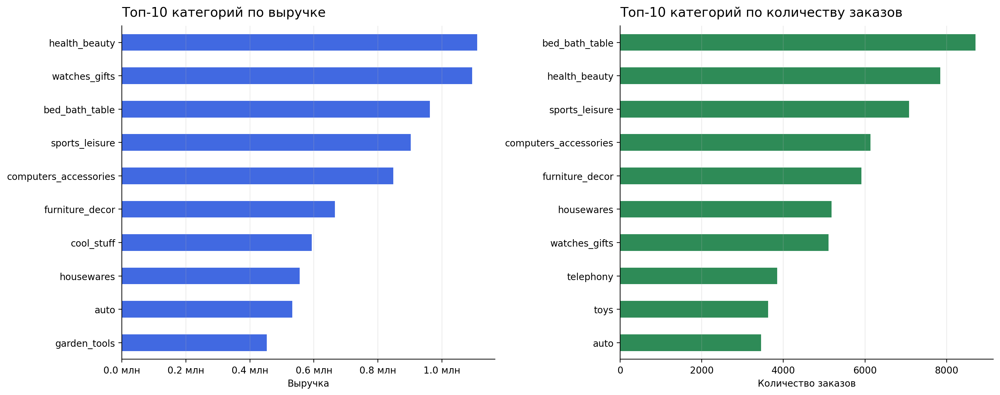
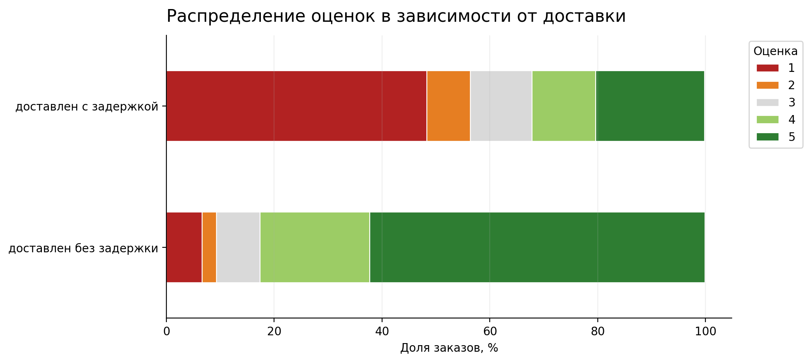

# Аналитика e-commerce бизнеса Olist

## Описание проекта

В данном проекте проводится анализ данных маркетплейса Olist — бразильской e-commerce платформы.

Проект имитирует задачу junior data analyst в e-commerce компании: необходимо изучить продажи, товарные категории, клиентскую базу и доставку, чтобы определить ключевые источники выручки, оценить ценность разных групп клиентов и понять, как сроки доставки связаны с клиентскими оценками.

Работа включает полный аналитический цикл: первичный обзор данных, подготовку аналитической базы, бизнес-анализ, SQL-проверку ключевых метрик и формулировку итоговых выводов.

---

## Цель проекта

Проанализировать продажи, товарные категории, клиентскую базу и доставку Olist, чтобы определить ключевые источники выручки, оценить ценность разных групп клиентов и понять, как сроки доставки связаны с клиентскими оценками.

---

## Бизнес-вопросы

В проекте рассматриваются пять основных вопросов:

1. Как менялись выручка, количество заказов и средний чек Olist по месяцам?
2. Какие категории товаров вносят наибольший вклад в выручку и количество заказов?
3. Какую роль в продажах играют новые и повторные клиенты?
4. Какие клиентские сегменты наиболее ценны для бизнеса?
5. Как сроки и задержки доставки связаны с оценками клиентов?

---

## Данные

В проекте используется открытый датасет **Brazilian E-Commerce Public Dataset by Olist**.

Источник данных: Kaggle.  
Период исходных данных: 2016–2018 годы.  
Основной период анализа: **2017-01 — 2018-07**.

Основной период анализа зафиксирован отдельно, чтобы исключить неполные и нестабильные месяцы в начале и конце датасета и не искажать динамику продаж.

Данные описывают заказы, клиентов, товары, оплаты, доставку и отзывы покупателей в бразильском e-commerce.

Основные таблицы:

- `olist_orders_dataset.csv` — заказы;
- `olist_customers_dataset.csv` — клиенты;
- `olist_order_items_dataset.csv` — товарные позиции в заказах;
- `olist_order_payments_dataset.csv` — оплаты;
- `olist_order_reviews_dataset.csv` — отзывы;
- `olist_products_dataset.csv` — товары;
- `product_category_name_translation.csv` — перевод категорий товаров.

Таблицы `olist_geolocation_dataset.csv` и `olist_sellers_dataset.csv` в текущей версии анализа не используются, потому что зафиксированные бизнес-вопросы не требуют географического анализа или отдельного анализа продавцов.

Сырые и обработанные данные не хранятся в репозитории. Для воспроизведения проекта исходные CSV-файлы нужно поместить в папку:

```text
data/raw/
```

---

## Методологические решения

### Валидные продажи

Для анализа продаж используются только валидные заказы:

- заказ доставлен;
- есть данные о товарных позициях;
- есть данные об оплате.

Такой подход позволяет не смешивать фактические продажи с отменёнными, недоступными или незавершёнными заказами.

### Расчёт выручки

В проекте используются два уровня расчёта выручки.

Для общей динамики продаж, среднего чека и клиентских сегментов используется `payment_value`, так как он отражает сумму оплаты заказа.

Для анализа товарных категорий используется `price`, потому что категории анализируются на уровне товарных позиций, а доставка и общая сумма оплаты заказа не всегда корректно распределяются между несколькими категориями внутри одного заказа.

### Клиентская сегментация

Классический RFM-анализ в проекте не используется напрямую, потому что большинство клиентов Olist сделали только один заказ. В такой ситуации показатель частоты покупок плохо разделяет клиентов, а квантильная сегментация по частоте заказов была бы искусственной.

Вместо этого используется адаптированная бизнес-сегментация по трём признакам:

- общей сумме покупок клиента;
- давности последней покупки;
- факту повторных заказов.

Такой подход позволяет отдельно выделить повторных клиентов и ценных разовых покупателей, которые могут быть перспективны для повторных продаж.

---

## Структура проекта

## Структура проекта

```text
E-Commerce Olist/
├── data/
│   ├── raw/
│   │   └── .gitkeep
│   └── processed/
│       └── .gitkeep
│
├── notebooks/
│   ├── README.md
│   ├── 01_data_overview.ipynb
│   ├── 02_data_preparation.ipynb
│   └── 03_business_analysis.ipynb
│
├── reports/
│   └── figures/
│       ├── sales_dynamics.png
│       ├── monthly_revenue.png
│       ├── top_categories.png
│       └── delivery_reviews.png
│
├── scripts/
│   ├── prepare_db.py
│   └── run_sql_analysis.py
│
├── sql/
│   └── analysis_queries.sql
│
├── .gitignore
├── requirements.txt
└── README.md
```

---

## Этапы проекта

### 1. Первичный обзор данных

Файл:

```text
notebooks/01_data_overview.ipynb
```

На этом этапе проводится первичное знакомство с данными:

- проверка наличия файлов;
- анализ размеров таблиц;
- проверка типов данных;
- анализ пропусков;
- проверка дубликатов;
- проверка уникальности ключей;
- анализ статусов заказов;
- проверка диапазона дат;
- проверка связей между таблицами.

Цель этапа — понять качество исходных данных и определить, какие таблицы нужны для дальнейшего анализа.

---

### 2. Подготовка аналитической базы

Файл:

```text
notebooks/02_data_preparation.ipynb
```

На этом этапе формируются подготовленные таблицы для анализа:

- приводятся даты к нужному формату;
- товары объединяются с переводами категорий;
- товарные позиции агрегируются до уровня заказа;
- оплаты агрегируются до уровня заказа;
- отзывы агрегируются до уровня заказа;
- формируется основная аналитическая база заказов;
- рассчитываются признаки доставки;
- выделяются валидные продажи;
- определяются новые и повторные клиенты;
- формируются клиентские сегменты;
- создаются таблицы для анализа категорий и доставки.

Подготовленные таблицы сохраняются в:

```text
data/processed/
```

---

### 3. Бизнес-анализ

Файл:

```text
notebooks/03_business_analysis.ipynb
```

На этом этапе проводится анализ по пяти бизнес-вопросам:

- динамика выручки, заказов и среднего чека;
- вклад товарных категорий;
- роль новых и повторных клиентов;
- ценность клиентских сегментов;
- связь доставки и клиентских оценок.

---

## SQL-проверка ключевых метрик

В проекте есть отдельная SQL-часть, которая используется как независимая проверка ключевых аналитических срезов на основе подготовленной базы данных.

Python используется для подготовки данных, построения аналитических таблиц и визуализации. SQL используется для проверки основных метрик и демонстрации работы с аналитической базой в формате, близком к реальным BI- и аналитическим задачам.

Файл с SQL-запросами:

```text
sql/analysis_queries.sql
```

Скрипты:

```text
scripts/prepare_db.py
scripts/run_sql_analysis.py
```

Скрипт `prepare_db.py` создаёт локальную SQLite-базу на основе подготовленных CSV-файлов из `data/processed`.

Скрипт `run_sql_analysis.py` запускает SQL-запросы из файла `sql/analysis_queries.sql` и выводит результаты в консоль.

SQL-запросы проверяют ключевые аналитические срезы за тот же период, что и основной бизнес-анализ: **2017-01 — 2018-07**.

Проверяемые срезы:

- помесячная выручка, количество заказов и средний чек;
- категории с наибольшей выручкой;
- вклад новых и повторных клиентов;
- клиентские сегменты;
- доля заказов с задержкой доставки;
- связь доставки с оценками клиентов;
- клиенты с наибольшей ценностью.

---

## Ключевые результаты

По итогам анализа валидных продаж за период с **2017-01 по 2018-07** получены следующие результаты:

- проанализировано **89 860 заказов**;
- общая выручка составила **14.39 млн** в валюте исходного датасета;
- средний чек составил **160.14**;
- категория с наибольшей выручкой — `health_beauty`;
- топ-5 категорий сформировали около **40% выручки**;
- повторные клиенты дали около **3% выручки**;
- наибольшую выручку среди клиентских сегментов дали `ценные давние разовые клиенты`;
- средняя оценка заказов составила **4.15**;
- около **8% заказов** были доставлены с задержкой.

---

## Визуализации

### Динамика продаж



График показывает динамику трёх ключевых показателей продаж: выручки, количества заказов и среднего чека. Это помогает понять, за счёт чего менялся общий объём продаж: роста количества заказов, изменения среднего чека или сочетания этих факторов.

### Помесячная выручка



График отдельно показывает масштаб помесячной выручки. Он помогает быстро увидеть периоды роста и просадки продаж без смешивания выручки с другими метриками.

### Топ категорий по выручке и заказам



График показывает, какие категории лидируют по выручке и количеству заказов. Это важно, потому что категория может быть массовой по числу заказов, но не обязательно самой значимой по денежному вкладу.

### Оценки клиентов в зависимости от доставки



График показывает распределение оценок покупателей в зависимости от статуса доставки. Такой формат полезнее средней оценки, потому что позволяет увидеть долю низких и высоких оценок внутри каждой группы заказов.

---

## Основные выводы

Продажи Olist в рассматриваемом периоде в основном зависят от новых покупателей. Повторные клиенты дали около 3% выручки, поэтому модель продаж в датасете выглядит слабо ориентированной на регулярные повторные покупки. Для бизнеса это риск: при росте стоимости привлечения клиентов низкая повторность может ограничивать устойчивость выручки.

Выручка заметно сконцентрирована в нескольких товарных категориях. Лидером по выручке стала категория `health_beauty`, а топ-5 категорий обеспечили около 40% продаж. Это показывает, что ограниченный набор категорий оказывает сильное влияние на общий финансовый результат маркетплейса.

Клиентская сегментация показала, что значимую ценность дают не только повторные клиенты, но и разовые покупатели с высокой суммой заказа. Наибольшую выручку среди сегментов дали `ценные давние разовые клиенты`. Это важный сигнал: даже разовые покупатели могут быть финансово значимой группой, с которой стоит работать через повторные коммуникации и персональные предложения.

Анализ доставки и отзывов показывает, что задержки доставки связаны с ухудшением клиентского опыта. Несмотря на высокую среднюю оценку заказов, заказы с проблемами доставки требуют отдельного внимания, потому что негативный опыт может снижать вероятность повторной покупки.

---

## Бизнес-рекомендации

1. Усилить работу с повторными покупками: персональные предложения, email-коммуникации, рекомендации товаров и программы лояльности.
2. Отдельно работать с ценными разовыми клиентами, так как эта группа уже показала высокую покупательную ценность.
3. Сфокусироваться на ключевых товарных категориях, которые дают основную долю выручки.
4. Контролировать задержки доставки и отслеживать их связь с клиентскими оценками.
5. Использовать клиентскую сегментацию для приоритизации маркетинговых и CRM-активностей.

---

## Используемые инструменты

- Python;
- pandas;
- numpy;
- matplotlib;
- Jupyter Notebook;
- SQLite;
- SQL;
- Git.

---

## Как запустить проект

1. Склонировать репозиторий:

```bash
git clone https://github.com/ge0g/E-Commerce-Olist.git
```

2. Перейти в папку проекта:

```bash
cd E-Commerce-Olist
```

3. Установить зависимости:

```bash
pip install -r requirements.txt
```

4. Поместить исходные CSV-файлы в папку:

```text
data/raw/
```

5. Последовательно запустить ноутбуки:

```text
notebooks/01_data_overview.ipynb
notebooks/02_data_preparation.ipynb
notebooks/03_business_analysis.ipynb
```

6. При необходимости создать SQLite-базу:

```bash
python scripts/prepare_db.py
```

7. Запустить SQL-проверку:

```bash
python scripts/run_sql_analysis.py
```

---

## Что показывает проект

Проект демонстрирует полный цикл работы с e-commerce данными:

- первичный обзор и проверку качества данных;
- подготовку аналитической базы из нескольких связанных таблиц;
- расчёт ключевых бизнес-метрик: выручки, количества заказов, среднего чека, долей категорий и клиентских сегментов;
- адаптацию клиентской сегментации под специфику данных;
- анализ новых и повторных клиентов;
- оценку связи доставки с клиентскими отзывами;
- использование SQL как проверочного слоя для ключевых метрик;
- формулировку выводов и бизнес-рекомендаций на основе данных.

Проект показывает умение не только писать код, но и связывать технический анализ с бизнес-вопросами: где формируется выручка, какие клиенты наиболее ценны и какие факторы связаны с клиентским опытом.